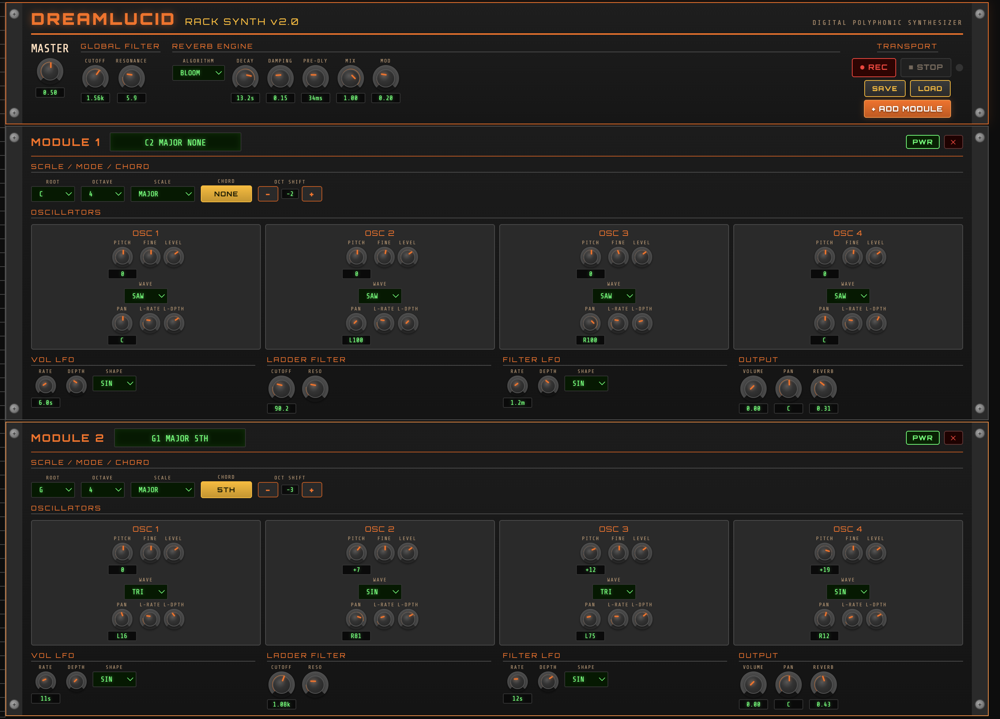

# DreamLucid Rack Synth v2.0

A browser-based polyphonic synthesizer styled after 1990s rack-mounted hardware synths. Built entirely with the Web Audio API — no dependencies, no build step. Just open `index.html` and play.

## Features

### Global Controls
| Control | Description |
|---------|-------------|
| **Master Volume** | Overall output level |
| **Global Filter** | Ladder-style lowpass filter with cutoff and resonance — applies to all audio including reverb |
| **Reverb Engine** | 7 algorithms inspired by the Strymon BigSky: Room, Hall, Plate, Spring, Shimmer, Cloud, Bloom. Controls for Decay, Damping, Pre-delay, Mix, and Modulation |
| **Transport** | Record to WAV file, Save/Load presets as JSON |

### Synth Modules
Add as many modules as you want — each one stacks vertically like rack gear. Every module has:

**Scale / Mode / Chord**
- Root note (C through B) and octave selection (1–7)
- 16 scales: Chromatic, Major, Minor, Harmonic Minor, Melodic Minor, Dorian, Phrygian, Lydian, Mixolydian, Locrian, Whole Tone, Blues, Pentatonic Maj/Min, Hungarian, Japanese
- Chord button cycles through 20 chord types: Maj, Min, Maj7, Min7, Dom7, Sus2, Sus4, Dim, Dim7, Aug, Min9, Maj9, Add9, 6th, Min6, 5th, MinMaj7, Aug7, HDim7 — automatically sets all 4 oscillator pitches
- Octave shift buttons (±3 octaves) to transpose the entire module

**4 Oscillators per Module**
Each oscillator has independent controls:
- **Pitch** — ±24 semitones from root
- **Fine** — ±50 cents detuning
- **Level** — individual volume
- **Waveform** — Sine, Sawtooth, Square, Triangle
- **Pan** — stereo position (spread oscillators for super-saw sounds)
- **Volume LFO** — per-oscillator tremolo with rate and depth

**Modulation & Output**
- **Volume LFO** — module-wide tremolo with rate (1s–2min), depth, and shape
- **Ladder Filter** — lowpass with cutoff (exponential mapping) and resonance
- **Filter LFO** — modulates filter cutoff from audio-rate (20kHz) down to 2-minute sweeps. Display switches between Hz and seconds at the 1 Hz threshold
- **Volume** — module output level
- **Pan** — module stereo position
- **Reverb Send** — amount routed to the global reverb

### Rotary Knobs
All controls use Ableton Live-style rotary knobs:
- **Drag up/down** to adjust values
- **Double-click** to reset to default
- **Mouse wheel** for fine adjustment
- Orange arc indicator shows current position

## Example Audio

Here's a sample recording made with DreamLucid:

https://github.com/ubermajestix/dreamlucid/raw/main/examples/dreamlucid-1774673574624.m4a

## Presets

Example presets are included in the `examples/` directory. Use the **LOAD** button in the Transport section to load them.

## Quick Start

1. Open the [live demo](https://ubermajestix.github.io/dreamlucid/) or clone and open `index.html` locally
2. Click anywhere to activate the audio engine (browser requirement)
3. You should hear sound immediately from the default module
4. Twist knobs by dragging up/down
5. Click **CHORD** to cycle through chord voicings
6. Click **+ ADD MODULE** to stack more synth voices
7. Hit **REC** to capture your sound as a WAV file

## Building Chords & Super-Saws

**Instant chords:** Select a root note and scale, then click the CHORD button to cycle through voicings. Each chord type automatically sets the pitch of all 4 oscillators.

**Super-saw trick:** Set all 4 oscillators to SAW waveform, then:
- Spread their PAN knobs across the stereo field (e.g., L100, L50, R50, R100)
- Add slight FINE detuning to each (e.g., -15, -5, +5, +15 cents)
- Layer with different octaves using the PITCH knobs

## Tech

- Pure Web Audio API — no libraries
- Reverb uses generated impulse responses (no sample files needed)
- WAV export with PCM encoding
- Preset system saves/loads complete state as JSON
- Responsive layout with 90s rack-mount aesthetic

## License

MIT
